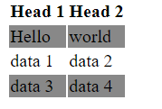

# 1. Difference Between Session and Cookies

| **Cookies**                                                  | **Session**                                                                                                 |
| ----------------------------------------------------------------------------------------------------------------------- | --------------------------------------------------------------------------------------------------------------------------------------------------------------------------------------------------------------------------- |
| Cookies hold user information on locally in browser.                                                                    | Sessions are server-side files that contain user data.                                                                                                                                                                      |
| Cookies can end on the lifetime set by the programmer.                                                                  | When the user quits the browser or logs out of the programmed, the session is over.                                                                                                                                         |
| It can only store a certain amount of info.                                                                             | It can hold an indefinite quantity of data.                                                                                                                                                                                 |
| The browser’s cookies have a maximum capacity of 4 KB.                                                                  | We can keep as much data as we like within a session, however there is a maximum memory restriction of 128 MB that a script may consume at one time.                                                                        |
| Because cookies are kept on the local computer, we don’t need to run a function to start them.                          | To begin the session, we must use the session start() method.                                                                                                                                                               |
| Cookies are not secured.                                                                                                | Session are more secured compare than cookies.                                                                                                                                                                              |
| Cookies stored data in text file.                                                                                       | Session save data in encrypted form.                                                                                                                                                                                        |
| In PHP, to get the data from Cookies , $\_COOKIES the global variable is used                                           | In PHP  , to get the data from Session, $\_SESSION the global variable is used                                                                                                                                              |
| We can set an expiration date to delete the cookie’s data. It will automatically delete the data at that specific time. | In [PHP](https://www.geeksforgeeks.org/php-tutorial/), to destroy or remove the data stored within a session, we can use the session_destroy() function, and to unset a specific variable, we can use the unset() function. |

# 2. How to insert copyright symbol in html?

|Char |Number    |Entity  |Description |
|-----|----------|--------|------------|
| ©   | `&#169;` | `&copy;` | COPYRIGHT  |
| ®   | `&#174;` | `&reg; ` | REGISTERED |
|€	| `&#8364;`	 | `&euro;` | EURO SIGN |

Just remember the entity name

example
```html
<h2 id="result">This is copyright symbol &copy</h2>
```

# 3. How to make zebra striped table

```html
<!DOCTYPE html>
<html lang="en">
<head>
    <title>Palindrome Checker</title>
    <style>
        tr:nth-child(even) {
            background-color: #888;
        }
    </style>
</head>

<body>
    <table>
        <tr>
            <th>Head 1</th>
            <th>Head 2</th>
        </tr>
        <tr>
            <td>Hello</td>
            <td>world</td>
        </tr>
        <tr>
            <td>data 1</td>
            <td>data 2</td>
        </tr>
        <tr>
            <td>data 3</td>
            <td>data 4</td>
        </tr>
    </table>
</body>
</html>
```

output:



# 4. Using HTML, CSS creates a striped background pattern.

```html
<!DOCTYPE html>
<html lang="en">

<head>
    <title>Palindrome Checker</title>
    <style>
        body {
            background: repeating-linear-gradient(
                to right,
                #fff,
                #fff 70px,
                #111 70px,
                #111 150px
            );
        }
    </style>
</head>

<body>
</body>
</html>
```